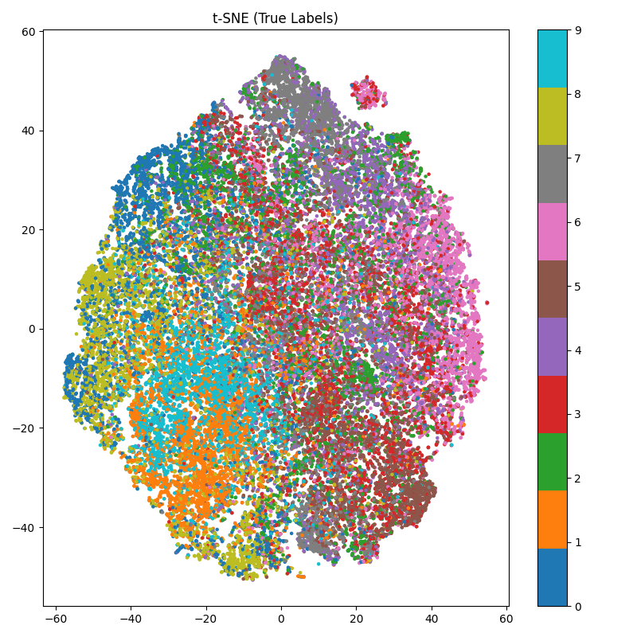
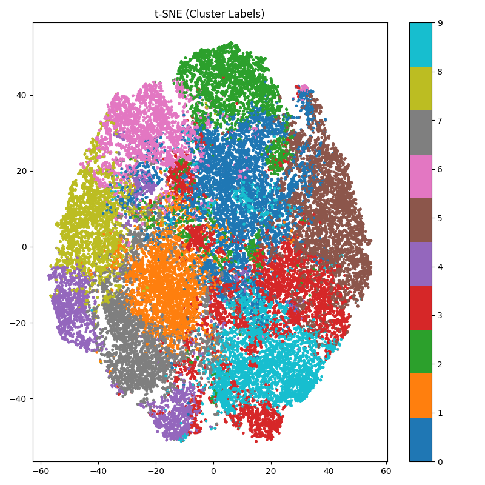
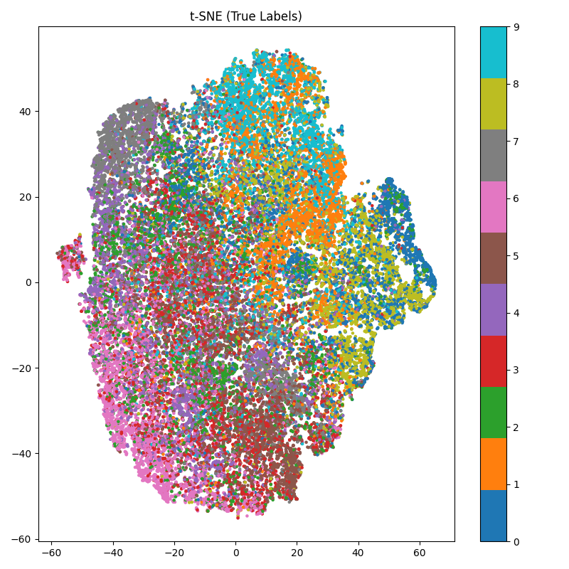
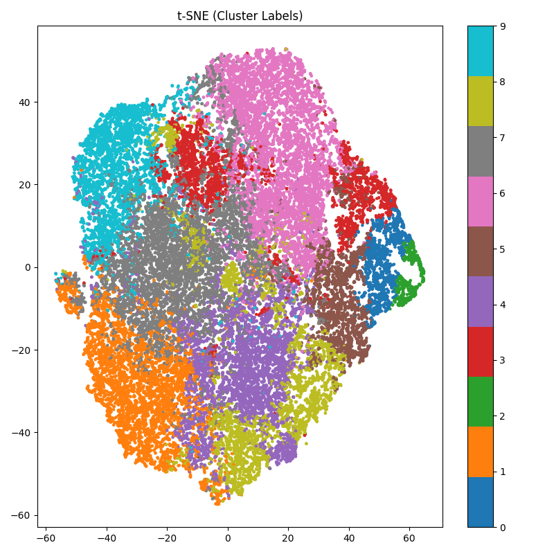

***🔍 Self-Supervised Image Representation Learning with SimCLR***

# 📌 Project Overview

This project explores **self-supervised representation learning** using the SimCLR framework on the CIFAR-10 dataset.

Instead of relying on labeled data, the model learns meaningful visual representations through **contrastive learning**, where different augmented views of the same image are treated as positive pairs.

The goal is to investigate:

- Whether useful features can be learned without labels
- How model architecture affects representation quality
- How well learned features align with semantic categories

# 🧠 Methodology

**1️⃣ Framework: SimCLR**

I adopt the Contrastive Learning paradigm:

- Apply strong data augmentations to generate two views of each image
- Train a neural network to maximize similarity between positive pairs
- Use negative samples from the same batch for contrast

**2️⃣ Model Architecture**

I experimented with two backbones:

- **ResNet18**
- **ResNet50**

Both models are implemented using PyTorch and followed by a projection head for contrastive training.

**3️⃣ Evaluation Strategy**

Since the training is unsupervised, I evaluate learned representations using:

**🔹 KNN Classification**

A K-Nearest Neighbors algorithm classifier is trained on extracted features to measure classification accuracy.

**🔹 t-SNE Visualization**

I applied t-SNE to visualize high-dimensional representations in 2D.

**t-SNE visualizations are not directly comparable in absolute layout, but demonstrates relative cluster structure and class separability.**

Two types of visualizations are generated:

- **True Labels** → ground truth categories
- **Cluster Labels** → unsupervised grouping via KMeans

**📊 Experimental Results**

**🔢 Quantitative Results**

| Model | Epochs | Batch Size | KNN Accuracy |
|---|---|---|---|
| ResNet18 | 50 | 512 | 61% |
| ResNet50 | 50 | 512 | 60% |

**📈 Qualitative Analysis (t-SNE)**

**🔹 True Label Visualization**

- Reveals the underlying semantic structure
- Shows whether samples from the same class cluster together

**🔹 Cluster Label Visualization**

- Shows how the model groups data without supervision
- Evaluates whether clustering aligns with real categories

**🔹Visualized Graph Comparison**
**ResNet-18**
| 1.1 True Label | 1.2 Cluster Label |
|----------------|-------------------|
|||

**ResNet-50**
| 2.1 True Label | 2.2 Cluster Label |
|----------------|-------------------|
|||

# 🔍 Key Findings

**1️⃣ Effective Representation Learning**

The model significantly outperforms random baseline (10%), achieving over 60% accuracy using KNN, demonstrating that meaningful features are learned without labels.

**2️⃣ Model Size vs Performance**

Interestingly, **ResNet18 slightly outperforms ResNet50** under the same training configuration.

This suggests:

- Larger models do not necessarily produce better representations
- Model capacity must match dataset scale and training conditions

**3️⃣ Representation Quality Analysis**

From t-SNE visualizations:

- ResNet18 exhibits more compact clusters and clearer separation
- ResNet50 shows more entangled representations
- KMeans clustering partially aligns with semantic labels

This indicates that:

The learned representations capture some semantic structure but remain imperfectly separable.

# 🧠 Insights

This project highlights an important principle:

**Better representations are not solely determined by model size, but by the balance between model capacity, data scale, and training dynamics.**

**⚙️ Implementation Details**

- Framework: PyTorch
- Dataset: CIFAR-10
- Training epochs: 50
- Batch size: 512
- Optimization: Adam
- Hardware: Nvidia Geforce RTX 5070 Laptop GPU (CUDA-enabled)

# 📁 Project Structure

project/

│

├── train.py              # Training pipeline

├── tsne_vis.py           # Visualization script

├── checkpoints/          # Saved models

├── graphs/				#Saved pictures for data analysis

└── README.md      

# 🎯 Conclusion

This project demonstrates that self-supervised learning can extract meaningful representations from unlabeled data, while also revealing the limitations of model scaling under constrained settings.

It provides both:

- **Empirical results** (KNN accuracy)
- **Visual evidence** (t-SNE analysis)

forming a complete and interpretable evaluation pipeline.
